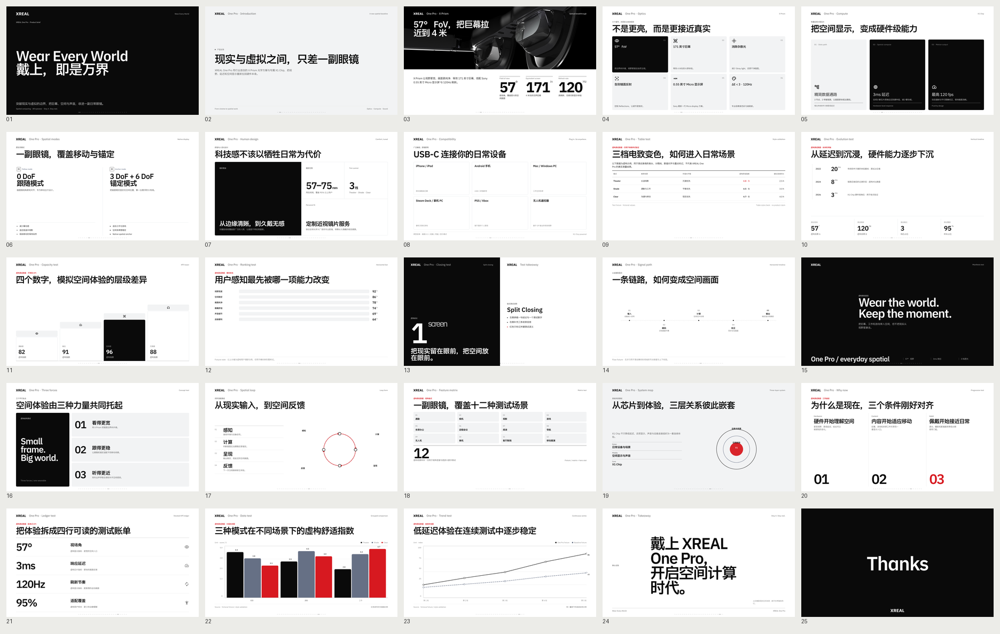

# xreal-ppt-skill

[](https://github.com/IF-Lawrence/xreal-ppt-skill/stargazers)
[](./SKILL.md)
[](./assets/template-xreal.html)

> 声明：本项目是基于 [op7418/guizang-ppt-skill](https://github.com/op7418/guizang-ppt-skill) 修改并面向 XREAL 场景重构的版本。

`xreal-ppt-skill` 是一个为 Codex 及兼容 Agent 环境设计的 XREAL 品牌演示文稿 Skill。它用锁定版式、品牌字体、官方媒体资产和自动校验器，生成可离线打开、横向翻页的单文件 HTML Deck。

[](./output/xreal-one-pro-test/index.source.html)

## 核心能力

- 固定的 XREAL 黑、白、灰视觉体系，红色仅用于关键数据、风险和操作语义
- 26 个正文锁定版式：`S01-S08` 与 `S11-S28`
- 纯英文使用 XREAL Diatype，中文/中英混排使用 IBM Plex Sans SC，日文/日英混排使用 IBM Plex Sans JP
- 内置 XREAL 品牌资产和产品媒体库，支持语义审计、槽位匹配与比例检查
- 支持键盘、滚轮、触屏、ESC 索引和 `B` 键低功耗模式
- 使用 Motion One 实现受控入场动效，复杂图表可通过内置 ECharts 组件扩展
- 校验器同时检查版式登记、品牌规则、媒体使用、字体语境和渲染边界

## 安装

使用 Skills CLI：

```bash
npx skills add https://github.com/IF-Lawrence/xreal-ppt-skill --skill xreal-ppt-skill
```

也可以手动克隆，并将仓库放到 Agent 可发现的 Skill 目录中：

```bash
git clone https://github.com/IF-Lawrence/xreal-ppt-skill.git
```

## 快速使用

对于第一次使用的用户，建议先阅读[中文用户教程](./docs/user-guide.zh-CN.md)。教程包含素材准备、PDF/OCR 预处理、可复制指令、内容保真模式、验收方法和常见错误处理。

安装和制作最好分成两个任务。安装完成并确认 Skill 可见后，在新任务中显式调用 `$xreal-ppt-skill`，同时明确最终交付物是 `index.html`：

```text
使用 $xreal-ppt-skill，把这份产品分析制作成 XREAL Style 网页演示文稿。
最终交付 index.html 及必要本地资产，不要生成 PPTX。保留原始截图、关键文本、数据和限定条件；内容放不下时优先增加页面，不要自行摘要。
```

适合的任务包括产品发布、数据汇报、年度总结、benchmark、流程/系统关系、路线图、高密度综合页和重点卖点 Bento。

## 工作流

1. 明确受众、场景、时长、素材、页数和必须保留的内容。
2. 从 `assets/template-xreal.html` 拷贝模板，并按语言语境复制字体和品牌资产。
3. 读取版式锁定、品牌规则和媒体规则，先选版式，再填充内容。
4. 完成文案、图片、图表和动效，保留模板的翻页与索引逻辑。
5. 运行静态与渲染校验，逐页检查后交付 `index.html` 及所需资产。

完整操作规则见 [SKILL.md](./SKILL.md)。

## 校验

```bash
node scripts/validate-swiss-deck.mjs path/to/index.html
```

校验器会先执行静态规则；当本地可用 Playwright/Chromium 时，还会检查渲染后的溢出、对齐、图表和媒体边界。

重要参考：

- [XREAL 品牌规则](./references/brand-xreal.md)
- [版式登记表](./references/layouts-swiss.md)
- [版式锁定契约](./references/swiss-layout-lock.md)
- [ECharts 组件规则](./references/xreal-echarts.md)
- [交付检查清单](./references/checklist.md)

## 目录结构

```text
xreal-ppt-skill/
├── SKILL.md
├── README.md
├── assets/
│   ├── template-xreal.html
│   ├── brand/
│   ├── fonts/
│   ├── media/
│   ├── echarts.min.js
│   └── motion.min.js
├── references/
├── scripts/
└── output/                 # 参考示例与渲染结果
```

## 开发约定

- 修改模板类名或版式时，同步更新 `layouts-swiss.md`、`swiss-layout-lock.md` 和校验器。
- 新增品牌或媒体规则时，同步更新 `brand-xreal.md`或 `checklist.md`。
- 保持单文件 HTML 交付、锁定版式和固定品牌色彩语义，不引入任意主题入口。
